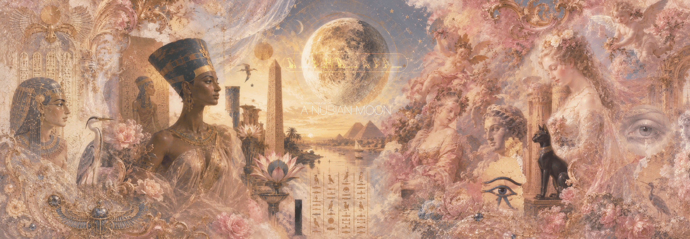

# A Nubian Moon  
   
    
<html>
	     
	            
</html>    
      
    
English to Egyptian Heiroglyphics.     
An interesting exercise in layouts, fonts, and text manipulation  
  
# References  
I did not realize what a deep topic this is!  
...and so many have done such brilliant work on the subject.  
On the shoulders of giants TBH.  
  
* (user fayrose's Middle Egyptian Dictionary Site)[https://github.com/fayrose/MiddleEgyptianDictionaryWebsite] and (Middle Egyptian Dictionary Dataset)[https://github.com/fayrose/MiddleEgyptianDataset]
* (LingoJam)[https://lingojam.com/HieroglyphicsTranslator] does it really well and offers really good explanations
* (Google's Noto Sans Egyptian Hieroglyphs)[https://fonts.google.com/noto/specimen/Noto+Sans+Egyptian+Hieroglyphs?preview.script=Egyp]
* (Hieroglyphs Everywhere Fonts)[https://github.com/HieroglyphsEverywhere/Fonts]
From user:fayrose's site:
* A Concise Dictionary of Middle Egyptian (1991, 2017) - Raymond O. Faulkner, 2017 ed. modernized by Boris Jegorovic, PDFs:(1991)[https://community.dur.ac.uk/penelope.wilson/Hieroglyphs/Faulkner-A-Concise-Dictionary-of-Middle-Egyptian-1991.pdf], (2017)[https://archive.org/details/pj1425.f3]
* Middle Egyptian Dictionary (2018, 2012) - Mark Vygus, PDFs: (2018)[http://rhbarnhart.net/VYGUS_Dictionary_2018.pdf], ()[]
* Dictionary of Middle Egyptian (2006) - Paul Dickson, PDF: ()[]